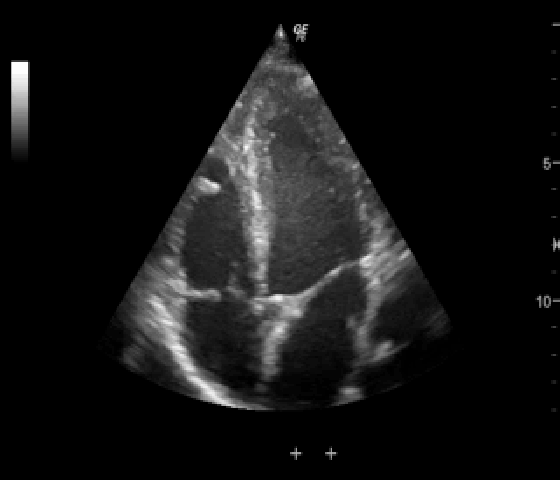
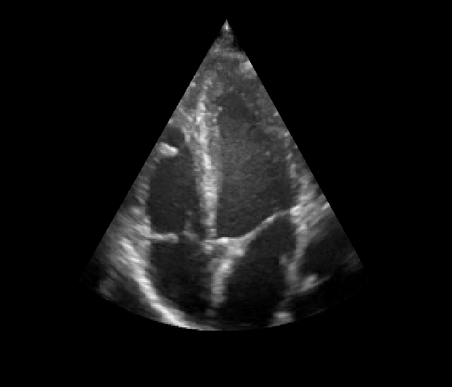

# Echo-Toolkit

Code repository for an echocardiography medical imaging toolkit.
Functionalities also extend to general ultrasound imaging.

We ask that you cite the `Domain Adaptation of Echocardiography Segmentation Via Reinforcement Learning` paper in exchange for the use of this project:

```
@InProceedings{Jud_Domain_MICCAI2024,
        author = { Judge, Arnaud and Judge, Thierry and Duchateau, Nicolas and Sandler, Roman A. and Sokol, Joseph Z. and Bernard, Olivier and Jodoin, Pierre-Marc},
        title = { { Domain Adaptation of Echocardiography Segmentation Via Reinforcement Learning } },
        booktitle = {proceedings of Medical Image Computing and Computer Assisted Intervention -- MICCAI 2024},
        year = {2024},
        publisher = {Springer Nature Switzerland},
        volume = {LNCS 15009},
        month = {October},
        page = {pending}
}
```

Current functionalities:
- Ultrasound sector extraction tool

### Usage notes
Inference time may be quite long if using an older GPU and long input sequences. 
Included test examples (which are small) for sector extraction require up to 2-3 seconds per prediction (using roughly 7GB of VRAM), using a NVIDIA RTX3090 GPU.

## Install

1. Download the repository:
   ```bash
   # clone project
   git clone --recurse-submodules https://github.com/arnaudjudge/Echo-Toolkit.git
   cd Echo-Toolkit
   ```
2. Create a virtual environment (Conda is strongly recommended):
   ```bash
   # create conda environment
   conda create -n echotk python=3.10
   conda activate echotk
   ```
3. Install [PyTorch](https://pytorch.org/get-started/locally/) according to instructions. Grab the one with GPU for faster training:
   ```bash
   # example for linux or Windows
   conda install pytorch torchvision torchaudio pytorch-cuda=11.8 -c pytorch -c nvidia
   ```
4. Install the project in editable mode and its dependencies, do the same for the ASCENT submodule:
   ```bash
   pip install -e .
   cd ASCENT
   pip install -e .
   cd ..
   ```

## Usage
### Ultrasound sector extraction

Ultrasound sector extraction removes all annotations, text, ECG trace and unnecessary information from the images, 
keeping only the region of interest, the *cone* or *sector*.

 --> 

This project contains a command line script to create and apply a mask to remove all such annotations. 
To run it, simply use the following command:

```bash
etk_extract_sector
```

By default, it will process input data from the `./data/examples/` folder at the project's root. 
Example images and sequences are included already [^1].

Many options are available through hydra (https://hydra.cc/docs/intro/) CLI override syntax or 
through modification/addition of config files. 
The main config files with all available default arguments is `./echotk/config/sector_extract.yaml`.

Examples of command line usage:
```bash
etk_extract_sector input=<NEW_PATH_TO_DATA>
etk_extract_sector input=<NEW_PATH_TO_DATA> output=<PATH_TO_OUTPUT> show_result_gifs=True save_metrics=True
```

The `input` argument must be a folder, file or list of files. Files are expected to be in nifti format.
By default, outputs files are send to `./output`.

## Implementation details
### Ultrasound sector extraction

The sector extraction tool is based on RANSAC. RANSAC (Random sample consesus) is an iterative algorithm 
to estimate parameters for a mathematical model, in this case lines and circles.
Based on points extracted from the edge of the ultrasound cone, two line models and one circle model are fit, 
then the resulting mask is reconstructed based on their intersections.

In order to improve performance, a nn-UNet model was trained (using the ASCENT project included as a submodule). 
This model predicts a cone for the input sequence of images. 
This cone is used to obtain an initial version of the sector mask.
Since the model has no enforced prior about the sector's shape, there can be inconsistencies in its shape.
RANSAC is therefore applied to the edge points of the prediction to obtain a reliable output mask.
We found that using the neural network before RANSAC rather than RANSAC alone (on variance metrics of input sequence) 
made for a much more robust method.

[^1] Images originally from Wikimedia Commons, available under Creative Commons License at https://commons.wikimedia.org/w/index.php?curid=25498405.